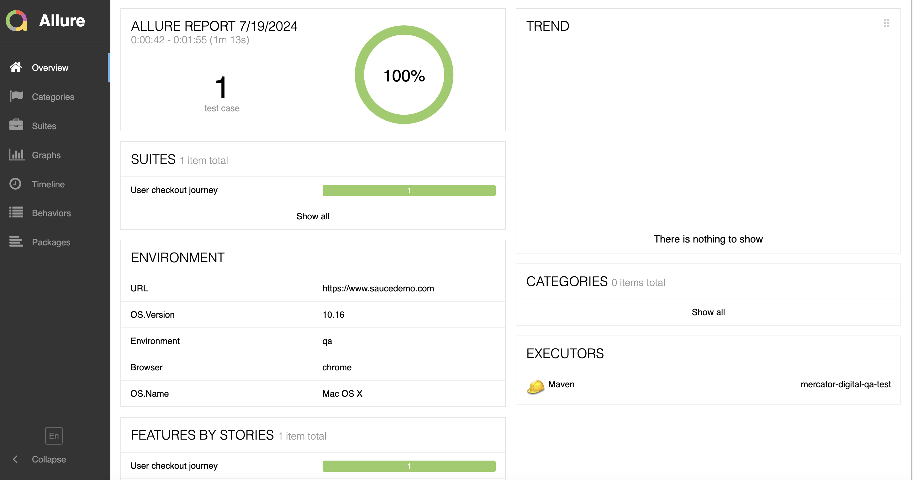
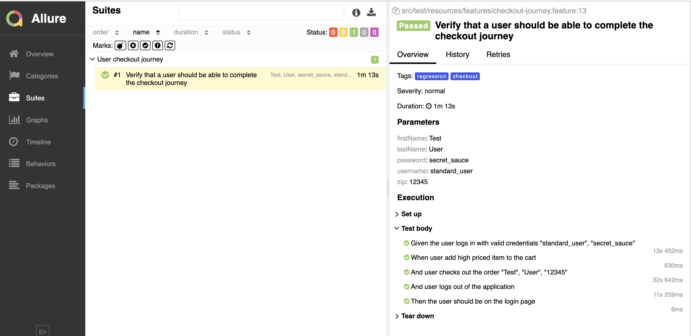

# mercator-digital-qa-test

This repository contains automated tests for a saucedemo app


### Prerequisites

Please make sure to install the following to use the test framework.

```
Java - 1.8
Maven - 3.5
Chrome Browser - v126
IntelliJ or Eclipse with Cucumber Plugin

```

## Built With

* Maven - Build Management
* Selenium - Web Automation Tool
* Cucumber - BDD Tests
* Hamcrest - Assertions
* Allure - Reporting

## Framework Features
* Runs automated tests on Chrome and Firefox browsers
* Runs on both browser client and headless mode.
* Automated drivers setup
* Logging
* Detailed Test Reporting


### Installing

Clone the [repository](https://github.com/venkata-qe/mercator-digital-qa-test) or download the Zip file directly into your local machine and extract it.

## Environment Configuration

Configuration.properties file is located in src/test/resources directory
to manage the environment properties such as browser name and env url.

Default browser is set to Chrome in the framework.

Please note that Chromedriver and Geckodriver is not required to download manually.
During test execution WebDriverManager library in the framework will identify the operating system type and
and downloads the related drivers into your machine.


## Running the tests

Go to the project directory(../mercator-digital-qa-test) and run the below maven commands to execute the tests.

#### To run all the tests in the project

```
mvn clean test

```

#### To run specific tests using cucumber tags

```
mvn clean test -Dcucumber.options='--tags @checkout'
```
```
The tests are configured with tags: @regression and @checkout.
```


### Example Test

Below is the example test
```
  @checkout
  Scenario Outline: Verify that a user should be able to complete the checkout journey
    Given the user logs in with valid credentials "<username>", "<password>"
    When user add high priced item to the cart
    Then user checks out the order "<firstName>", "<lastName>", "<zip>"
    And user logs out of the application
    Examples:
      | username      | password     | firstName | lastName | zip   |
      | standard_user | secret_sauce | Test      | User     | 12345 |

```


## Reporting

After executing the tests we can generate the test report using allure command.

```
mvn allure:serve
```
Report will be generated into target folder.
Allure will start a Web server automatically and render the results in default browser.

#### Example report



### Run tests and generate report using one command

To run the tests and generate report in single command.

```
mvn clean test allure:serve
```
